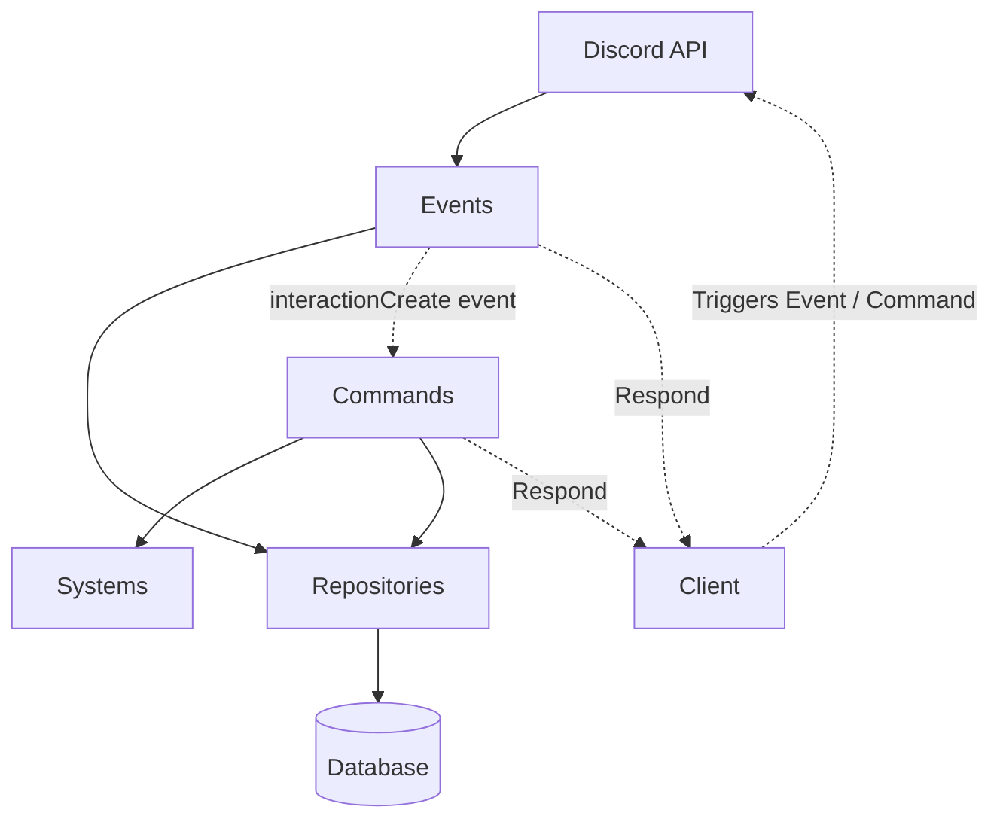

# JUSTICE-BOT

 
 Discord.js bot developed for [League of Legends Romania Discord](https://discord.com/invite/lolro) dedicated to moderation and cutomizable features.


## Features

- Moderation commands
- Multi-layered autovoice
- Customizable LFG (Looking For Group) general scoped system
- Logging events
- Keys based premium system
- Ticket support system

## Demo
This is a demo of a few of the systems above, showing how a logging channel looks like, using the autovoice system to send an LFG post and then opening and closing a ticket.


## Technologies used
 - [Nodejs](https://nodejs.org/en/)
 - [TypeScript](https://www.typescriptlang.org/)
 - [Discordjs](https://discordjs.guide/#before-you-begin)
 - [PostgreSQL](https://www.postgresql.org/)
## Design decisions
- Typescript is a robust superset of Javascript which prevents bugs at compile time and makes the code easier to read than vanilla JS
- PostgreSQL is important for relational consistency within the data stored by the bot
- Discordjs is the most used and feature rich framework for building discord bots. Also Discord is built on Electron, which makes its APIs closer to Javascript than any other language
## Architecture

The bot is split down into the following main parts:
- Commands: The active frame through which users call the bot to perform tasks
- Events: Callback functions for each message sent by Discord over the WebSocket connection to make the bot reactive to changes involving the users and the server. Mainly used for logging actions.
- Systems: Frameworks for building complex and specific features
- Models and Repositories: Compose the layer that provides communication between the bot and the database
- utility_modules: Repeatable patterns or standardized solutions to specific tasks are under this directory

 **Architecture diagram**
The diagram below shows a basic flow of how the Client (the user-end) triggers the Discord APIs by taking actions which includes executing commands, which triggers the event callbacks that, in case of the command, calls the corresponding command to execute which may use systems and repositories. While the events execute directly and may as well use repositories. 


## Docs
- 
## How to Use / Install

Running the bot requires Nodejs and PostgreSQL to be installed and set up.
If you need help with that, please refer to the server setup guide [here](https://github.com/rootblind/justice-bot/blob/main/docs/server_setup_guide.md).

Clone the project

```bash
  # HTTP
  git clone https://github.com/rootblind/justice-bot.git

  # SSH
  git@github.com:rootblind/justice-bot.git
```

Go to the project directory

```bash
  cd justice-bot
```

Install dependencies

```bash
  npm install
  #make sure to be in the project folder
```

Use Nodejs to run the bot

```bash
  node -r dotenv/config ./dist/justice.js
```

## NPM scripts

```bash
# Compile the TypeScript sources into JavaScript
npm run build

# Start the bot
npm run start 

# Build and start the bot, on source change, re-build and re-start the bot using nodemon
npm run dev

# Empty the dist/ directory
npm run clean

# Scan the code using ESlint
npm run lint

# Scan the code and automatically fix ESlint errors if possible
npm run lint:fix
```

## Database

Justice-bot uses PostgreSQL, while the database can be replaced with not much effort, you can learn about Postgres [here](https://www.youtube.com/watch?v=SpfIwlAYaKk).

## Environment Variables

To run this project, you will need to add the following environment variables to your .env file


`Your token: BOT_TOKEN`

`Your bot secret: CLIENT_SECRET`

`Your bot client ID: CLIENT_ID`

`Your discord ID: OWNER`

`The server where you test the bot: HOME_SERVER_ID`

`The database password: DBPASS`

`The host IP (set to localhost if you run it on your PC): DBHOST`

`Your database username: DBUSER`

`The host port: DBPORT`

`The database name: DBNAME`

`The text classification ML API: MOD_API_URL`

`Encryption key: ENCRYPT_KEY`

`Initialization vector: IV`

`Encryption algorithm: ALGORITHM`

If you want to connect the bot to an web application:

`WEB_BACK_PORT`

`WEB_FRONT_PORT`

Environment variables example: [env_vars.txt](https://github.com/rootblind/justice-bot/blob/main/env_vars.txt)

## Language Model API

The bot uses an API provided by my own language model. At the moment there is only one classification model that helps with auto moderation if you set up a `flagged-messages` logging channel.

Please visit the ML repository [here](https://github.com/rootblind/opjustice-lm).

Do note, that project is still in work as well!
## Author

- [@rootblind](https://www.github.com/rootblind)
## License

- [GPL v3](https://github.com/rootblind/justice-bot/blob/main/LICENSE)
## League of Legends Romania
Justice is a project developed with League of Legends Romania's needs in mind, you can check it out at [discord.gg/lolro](https://discord.com/invite/lolro)
