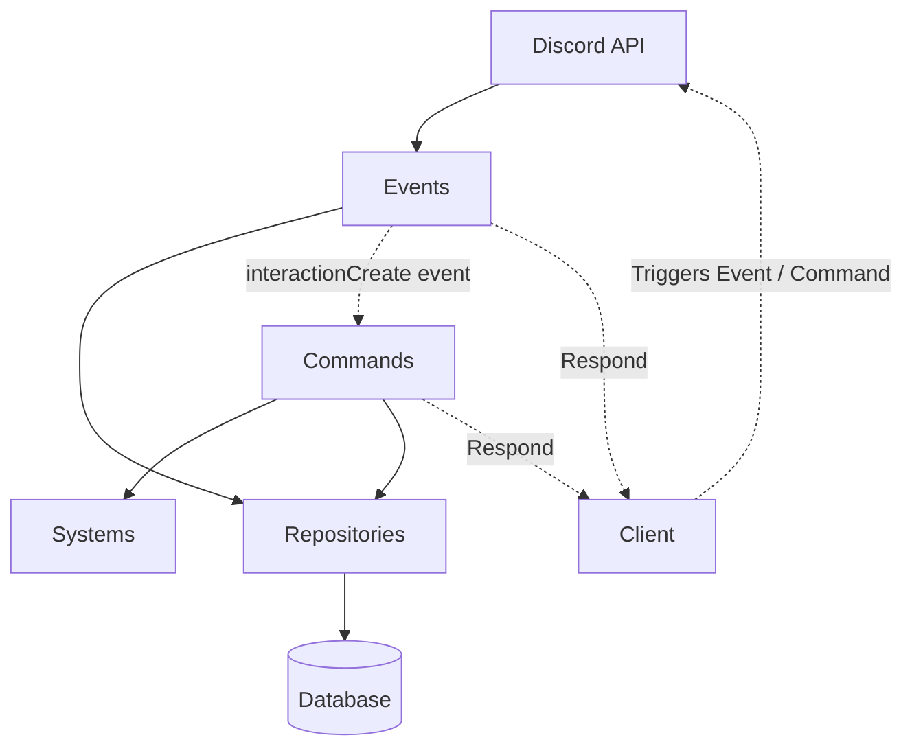

# Architecture

In this document the software is described along with its components and what they are used for.
It's assumed that the reader is familiar with the technologies involved in this project as this documents how they are used to build Justice-bot.

## Overview

Justice-bot is a collection of systems built on top of the Discordjs framework to build a modern and feature rich Discord bot focused on moderation, logging and systems that add functionality to a Discord server such as the Autovoice system and the LFG system.

The philosophy of Justice-bot is to have independent systems that use common general purpose resources to build functionality on top of the Discord bot which is just an interface between the Client (discord users) and the systems.

## Diagram

The bot is split down into the following main parts:
- Commands: The active frame through which users call the bot to perform tasks
- Events: Callback functions for each message sent by Discord over the WebSocket connection to make the bot reactive to changes involving the users and the server. Mainly used for logging actions.
- Systems: Frameworks for building complex and specific features
- Models and Repositories: Compose the layer that provides communication between the bot and the database
- utility_modules: Repeatable patterns or standardized solutions to specific tasks are under this directory

 **Architecture diagram**
The diagram below shows a basic flow of how the Client (the user-end) triggers the Discord APIs by taking actions which includes executing commands, which triggers the event callbacks that, in case of the command, calls the corresponding command to execute which may use systems and repositories. While the events execute directly and may as well use repositories. 

## Structure

This section describes each major directory and its purpose.

The only files that live directly under the source directory are:

- justice.ts: This is the entry point of the application, the main file, but for novelty reasons, it was named like the bot. This is also the most abstract part of the codebase as it calls the initializer of the Client object, sets it up, loads and registers commands, events and error listeners and boots up the bot.
- client_provider.ts: Defines the methods through which the Client object is instantiated, set and requested. The init function loads custom caching and cleanup parameters.

### Commands

Commands are callbacks to the `interactionCreate` event. Each command has its own source to execute. Commands are grouped in subdirectories based on the kind of task it performs.
Commands run the highest abstractions of the systems, being one of the ways users interact with the bot.

### Config

API configurations for tools or external applications such as the database, locale (i18n) and the cache library.

### Events

Events are Discord API messages that trigger callbacks upon users or servers performing specific actions.
In this directory, separated in subdirectories depending if the event refers to the client, a guild (server) or an interaction being created, are the sources that are executed upon event callbacks.

### Handlers

Before the bot connects to the Discord server, it needs to load the source files for commands and events as objects to be sent to Discord to be registered. Handlers ensure this important functionality.

### Interfaces

A collection of reusable interfaced used across the codebase. Interfaces are categorized based on the kind of data they represent. Database related interfaces are in `database_types.ts` and general scope interfaces are inside `helper_types.ts`.

- commands: The interface used to build command sources

- commandFile: The interface used for command source handling

- database_types: Interfaces and types for database tables and columns

- event: The interface used to build event sources and to handle event files

- helper_types: Interfaces and types with a general scope or system specific scope, unrelated to database, server or Discord API

- server_types: Interfaces and types specific for the REST API of the express application

- lfg_system: Types specific to the LFG System

### lolro_pack

While the majority of the bot is written with general purpose in mind, very specific features that are required by League of Legends Romania are inside this pack.

Some features require having League of Legends in mind and can not be easily generalized without a lot of overhead for what should be a simple feature.

### Models and Repositories

Those are the only places where queries are being used and the rest of the codebase requires calling repositories in order to communicate with the database.

- Models define the tables of the database that are constructed by a source inside this directory called `modelsInit.ts` which loads and executes each model source file
- Repositories define method to interact with specific tables  in determinated ways. Each repository file corresponds to a model file with the same name

### objects

Compile time constants.

As .json files are not copied over to `dist/`, it's more convenient to define config files as source files that can be imported wherever needed.
### server

The REST API backend of the bot to expose endpoints.

Intented to be used with a dashboard web application.

### Systems

Feature specific subsystem built on top of Discordjs form a system.

Systems are required by features that use multiple commands / subcommands that would require over 1000 lines of code and that would benefit from modularization of reusable code.

Another purpose of a system-based feature is that it enables it to be implemented through multiple kinds of interactions. For example having the same logic run behind both a slash command and a button interaction without the need to change something as a good implementation of the system is agnostic to the way it's called while it can get the required input.

### types

Modules that require specific declarations.

### utility_modules

Provides bot-wide abstractions and standardized implementations. Unlike Systems, which encapsulate feature-specific functionality, utility modules provide functionality intended to be reusable across unrelated features.

- attach_collectors: As some systems require persistent message collectors across bot restarts, they provide an attachment method for their specific collect. In attach_collectors, the bot queries the database for the messages that need their collectors to be re-attached an interates through all guilds making the checks needed before calling the method.

- button_builders: Reusable `ButtonBuilder` objects that can be used instead of building new ones.

- cron_tasks: Defining cron tasks is standardized under CronTaskBuilder interface, in this file all the tasks that need scheduled execution are defined to be handled.

- cronHandler: Loads and handles the tasks defined in cron_tasks.

- discord_helpers: Standardized calls of Discordjs functions. For example fetching a GuildMember is done through `fetchGuildMember()` as it handles errors by itself and returns a `null` instead of throwing a top level error as the default function does.

- embed_builders: Reuseable and already built embeds that can be used instead of defining new ones. Also `embed_message()` and `embed_error()` provide the template for most replies.

- error_logger: winston error logger object and a handle method called async inside the catch block

- on_ready_tasks: OnReadyTaskBuilders to be imported by onReadyTasksHandler. On ready tasks are executed once at clientReady event

- onReadyTasksHandler: Contains the loader, builder and initializer for OnReadyTaskBuilders. Tasks inside attach_collectors and on_ready_tasks are executed by it.

- utility_methods: General scope methods that are not specific to Discord API. Also the most comprehensive library of the codebase.

- event_hooks: Events have hooks implemented. Through OnReadyTaskBuilder events can have their functionality extended.

- regex_classifier: Regex based engine for detecting keywords inside messages.